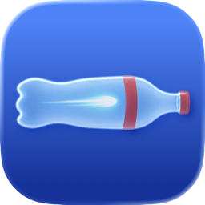

# spad_capture

<table align="center"><tr>
<td valign="middle"><a href="https://github.com/NikhilBehari/spad_capture/releases/latest"></a></td>
<td valign="middle">Prefer a one-click setup? Download the <b>SPAD App</b>:<br>
<a href="https://github.com/NikhilBehari/spad_capture/releases/latest/download/SPAD-App-mac.zip">Download for Mac</a> · <a href="https://github.com/NikhilBehari/spad_capture/releases/latest/download/SPAD-App-win.zip">Download for Windows</a></td>
</tr></table>

Capture pipeline for SPAD time-of-flight sensors. Records per-zone histograms
with an integrated live web dashboard, optional colocated Realsense capture
(RGB / depth / IR), and one storage format per run.

It supports two sensors:

| backend | sensor | histograms |
|---|---|---|
| `spad tmf` | AMS OSRAM **TMF8828** | per-zone ToF counts from predefined or user-defined SPAD masks |
| `spad st`  | ST **VL53L8CH** | per-zone CNH magnitudes over a configurable mm window |

## Install

```bash
# setup spad env
conda env create -f environment.yml
conda activate spad_capture
pip install -e .

# flash the dev board
spad tmf flash          # for AMS SPADs
spad st  flash          # for ST SPADs

# optional Realsense camera support
pip install -e '.[rgb]'                     # Linux, Windows
conda install -c conda-forge pyrealsense2   # macOS
```

## Capture

```bash
# TMF: default config - 3x3_wide, long_range, 10 frames
spad tmf capture
spad tmf capture --zone 4x4_wide --range short --kilo-iter 5000 -n 20
spad tmf capture -c configs/tmf/8x8.yaml
spad tmf capture --mask configs/tmf/masks/four_center_quads.yaml

# ST: default config - 4x4, 0-2000 mm, 10 frames
spad st capture
spad st capture --start-mm 200 --end-mm 1200 --freq 15
spad st capture -c configs/st/8x8.yaml
```

Each backend has a few more commands of its own (`flash`, `viz`, and the ST's
`detect` / `info`): [docs/tmf.md](docs/tmf.md), [docs/st.md](docs/st.md).

Add `--viz` for the live dashboard at `http://127.0.0.1:8888`, and
`--rgb --save-depth --ir-left --ir-right` for colocated Realsense capture.
`spad camera check` diagnoses the camera. Realsense capture on macOS needs `sudo`:
[docs/docs.md](docs/docs.md#realsense-on-macos).

## Key parameters

The main fields tuned per capture, as YAML and as CLI flags. Full schema:
[docs](docs/docs.md) · [tmf](docs/tmf.md) · [st](docs/st.md).

```yaml
# YAML field: value                   # CLI flag     meaning

# shared
capture:
  mode: sequential | timed | manual   # --mode       capture type; see docs

storage:
  format: pkl | npy | h5 | npz | none # -f           output file format

viz:
  enabled: true | false               # --viz        live capture dashboard
  port: e.g. 8888                     # --viz-port   bind port

rgb:
  enabled: true | false               # --rgb        colocated Realsense
  save_depth: true | false            # --save-depth depth alongside colour
  ir_left | ir_right: true | false    # --ir-left    IR planes

# tmf
sensor:
  zone_mode: 3x3_wide | 8x8 | ...     # --zone       capture zone mode
  range_mode: long | short            # --range      4.41 m vs 1.566 m

firmware:
  kilo_iterations: e.g. 5000          # --kilo-iter  per-frame pulses
  period_ms: e.g. 0, 16               # --period-ms  min frame interval

# st
sensor:
  mode: 4x4 | 8x8                     # --mode       zone grid
  start_mm | end_mm: e.g. 0, 2000     # --start-mm   histogram window
  bin_mm: e.g. 37.5348                # --bin-mm     requested bin width
  ranging_frequency_hz: 1..30         # --freq       ranging rate
```

Flags override the config file:
`spad tmf capture -c configs/tmf/8x8.yaml --range short`.

## Selecting zones

Both sensors let you choose which part of the array reports a histogram.

**TMF8828 — per-pixel mask.** Author a SPAD layout in YAML on the 12 x 18 SPAD
grid. Each digit names a zone; pixels sharing a digit sum into one output
histogram, so zones can be any shape.

```yaml
# four 2x2 zones around the optical center
mask:
  grid: |
    x x x x x x x x x x x x x x x x x x
    . . . . . . . . . . . . . . . . . .
    . . . . . . . . . . . . . . . . . .
    . . . . . . 1 1 . . 2 2 . . . . . .
    . . . . . . 1 1 . . 2 2 . . . . . .
    . . . . . . . . . . . . . . . . . .
    . . . . . . . . . . . . . . . . . .
    . . . . . . 3 3 . . 4 4 . . . . . .
    . . . . . . 3 3 . . 4 4 . . . . . .
    . . . . . . . . . . . . . . . . . .
    . . . . . . . . . . . . . . . . . .
    x x x x x x x x x x x x x x x x x x
```

```bash
spad tmf mask validate configs/tmf/masks/four_center_quads.yaml
spad tmf mask preview  configs/tmf/masks/four_center_quads.yaml
spad tmf capture --mask configs/tmf/masks/four_center_quads.yaml
```

Mask rules and coordinates:
[docs/tmf.md § mask](docs/tmf.md#mask-user-defined-spad-layout-zone_modecustom-only).

**VL53L8CH — rectangular ROI.** Select a rectangle on the fixed 4x4 or 8x8
grid with `--zone ROW,COL` for one zone or `--roi` for a block. Fewer zones
free CNH memory for more bins over a longer window:

```bash
spad st capture --zone 2,2 --end-mm 4000     # one zone, many bins
spad st capture --roi 2,2,2,2                # 2x2 block
spad st info -c configs/st/8x8.yaml          # bins and budget before capturing
```

Window, binning and the CNH budget: [docs/st.md](docs/st.md).

## Saved captures

Output writes to `outputs/<run>/` with `metadata.json`, `config.yaml` and one
data file: `data.pkl` by default for tmf, `data.npz` for st. Switch with `-f`.
Trade-offs: [docs/docs.md § storage](docs/docs.md#storage).

Read in Python:

```python
from spad_capture.storage import load, user_zone_histograms

# every format returns the same shape: (metadata, list of frame dicts)
meta, frames = load("outputs/<run>/data.h5")
frames[0]["histogram"]        # (H, W, num_bins); int32 for tmf, float32 for st
frames[0].get("ambient")      # st only
frames[0].get("ir_left")      # present on the frames that carried a camera plane

# tmf: drop auto-added dummy-pixel zones
zone_ids, hists = user_zone_histograms(meta, frames)
# hists: (n_frames, n_user_zones, 128); zone_ids: e.g. [1, 2, 3, 4]
```

Replay through the dashboard:

```bash
spad tmf viz --source outputs/<run>/data.h5
spad st  viz --source outputs/<run>/data.npz
```

## Documentation

- [docs/docs.md](docs/docs.md): fields shared by both sensors.
- [docs/tmf.md](docs/tmf.md): TMF8828 sensor fields, masks, calibration, firmware.
- [docs/st.md](docs/st.md): VL53L8CH sensor fields, window and bins, firmware.
